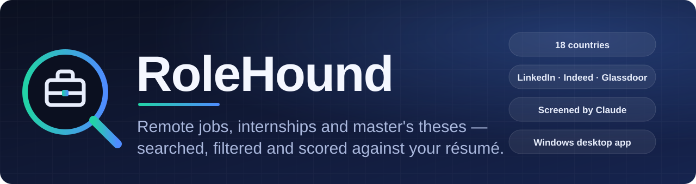
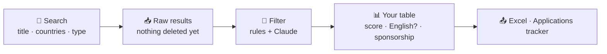

<div align="center">



<br>

[](https://github.com/Sina-Ghiabi/Job-Finder/stargazers)
[](#-before-you-start)
[](#-step-by-step)
[](https://apify.com)
[](https://www.anthropic.com)
[](LICENSE)

**Find jobs abroad without reading a thousand adverts yourself.**

[Why](#-why-this-exists) · [What it does](#-what-it-does) · [Before you start](#-before-you-start) · [Step by step](#-step-by-step) · [Speed](#-speed) · [Docs](Document.md)

</div>

<br>

## 💛 Why this exists

Job Finder was built to make **finding work easier for Iranians living abroad** — people who need
roles that fit a visa, a language and a CV, and who cannot afford to scroll through thousands of
irrelevant listings to find the few that matter.

> **If it helps you, please give it a ⭐ — it is the only way other people find it.**

<div dir="rtl">

این برنامه برای ساده‌تر کردن پیدا کردن کار برای ایرانیان خارج از کشور ساخته شده است.
اگر به دردتان خورد، لطفاً یک ⭐ بدهید.

</div>

<br>

## ✨ What it does

You type a job title and pick countries. Job Finder asks the big job boards, throws away what you
could never take, and shows you the rest — scored against **your** résumé.



| | |
|---|---|
| 🌍 **18 countries** | Italy, Germany, Netherlands, UK, France, Spain, Switzerland, Nordics, Canada, Australia, USA and more |
| 🎯 **Three kinds of search** | Jobs (Entry · Junior · Mid · Senior), **Internships**, and **Master's theses** — each in English first, then the country's own language |
| 🏠 **Remote or Any** | *Remote* asks every platform for remote work using each one's own parameter; *Any* keeps everything |
| 🗣️ **English? column** | Tick *English only* and nothing that demands another language shows up |
| 🤖 **Claude reads every advert** | Drops what you cannot do and scores the rest against your résumé — and **nothing is deleted without you seeing it** |
| 🛂 **Visa sponsorship** | A column for it, using public sponsor lists where they exist |
| 🗂️ **Applications tracker** | Remember what you applied to, and export everything to Excel |

<br>

## 🧰 Built with

| Part | What it uses |
|---|---|
| **Job boards** | [LinkedIn](https://apify.com/apimaestro/linkedin-jobs-scraper-api) · [Indeed](https://apify.com/valig/indeed-jobs-scraper) · [Glassdoor](https://apify.com/valig/glassdoor-jobs-scraper) through **Apify** actors |
| **Google** | [Apify Google Search](https://apify.com/apify/google-search-scraper) + a page crawler, for company career pages and local job boards |
| **Screening & scoring** | **Claude** (Anthropic API) |
| **Optional extras** | Jooble · Reed (UK) · France Travail · DeepL for translation |
| **App** | Python · **PySide6** (Qt) · pandas · openpyxl |

<br>

## 📋 Before you start

Get these ready first:

| You need | Why | Required? |
|---|---|---|
| **Windows 10 or 11** and **Python 3.8+** | to run the app | ✅ |
| An **[Apify](https://apify.com) account** and its **API token** | the searches run as Apify actors, and you pay Apify per result | ✅ |
| An **[Anthropic](https://console.anthropic.com) API key** with some credit | Claude reads every advert and scores it against your résumé | ✅ for the smart pass · *without it only the instant keyword rules run* |
| Your **résumé** as **PDF or Word (.docx)** | Claude takes every fact about you from it — where you live, your languages, your skills | ✅ for the smart pass |
| Jooble · Reed (UK) · France Travail keys | extra sources for some countries | optional |

> 💡 **Mind the cost.** Apify and Claude bill you directly. While you are trying things out, set the
> **Results limit** dropdowns in the Search window to a small number (for example 50).

<br>

## 🪜 Step by step

### 1 · Install

```bash
git clone https://github.com/Sina-Ghiabi/Job-Finder.git
cd Job-Finder
python -m venv .venv
.venv\Scripts\activate
pip install -r requirements.txt
python main.py
```

### 2 · Get your Apify token

1. Create an account at **[apify.com](https://apify.com)** and add a payment method or credit.
2. Open **Settings → API & integrations** and copy your **Personal API token** (it starts with `apify_api_`).

### 3 · Get your Anthropic key

1. Create an account at **[console.anthropic.com](https://console.anthropic.com)**.
2. Open **Plans & Billing** and add credit — a key with no credit fails with *"credit balance is too low"*.
3. Open **API keys → Create key** and copy it (it starts with `sk-ant-`).

### 4 · Start a search

Click **New Search**. The Setup window asks, from top to bottom:

| Field | What to put |
|---|---|
| **Apify API token** / **Anthropic API key** | the two keys from steps 2 and 3 |
| **Job title** | for example `Data Engineer` |
| **Type** | *Any* (jobs, internships and theses), *Thesis*, or *Internship* |
| **Remote / Any** | *Remote* asks every platform for remote work only; *Any* brings everything, and you decide later |
| **Posted within** | how far back to look |
| **Platforms** | tick the ones to use and drag to reorder — untick **Google** for a quick first run |
| **What to ask each platform for** | one dropdown per platform setting, including **Results limit** to cap the cost |
| **Countries / cities** | where to look |

Press **Start Search**. The **Log** at the bottom shows every step live. When it ends, the table fills with the
**raw results — nothing has been filtered or deleted yet.**

### 5 · Upload your résumé and press Filter

1. Click **Filter**. A window opens with your job title, Type and Remote / Any, plus the filters.
2. Under **Résumé** click **Choose résumé…** and pick your **PDF or Word** file. **Preview** shows exactly what Claude will read.
3. Leave **Read every survivor with Claude** ticked for the accurate pass (untick it for instant, free, keyword-only filtering).
4. Optionally set a **Résumé match** minimum, and the Visa, Where and When filters.
5. Press **Filter N listings**.

If Claude doubts some listings, a review window lists them with the reason — **nothing is removed until you confirm it**.

### 6 · Read, apply, export

- **Click a row** to open the listing. Every column has an Excel-style filter — for example tick *English only* in the **English?** column.
- **Apply** records an application in **My Applications**, where you can also add ones you made by hand.
- **Export Excel** saves everything you are looking at.

### If something goes wrong

| Problem | What to do |
|---|---|
| *"credit balance is too low"* | add credit in Anthropic **Plans & Billing** |
| **Health Check** button | a free test of every source before you spend anything |
| The app closes suddenly | open `%APPDATA%\JobDesk\crash.log` and attach it to an issue |

Prefer a single `.exe`? See [Document.md](Document.md#building-the-exe).

<br>

## ⏱️ Speed

| Source | How long |
|---|---|
| LinkedIn · Indeed · Glassdoor | ⚡ **Fast** — the quick sources |
| **Google** | 🐢 **Much slower** — it searches the web and then opens each page. Untick it for a quick run and add it when you can wait |

<br>

## 📚 Documentation

The full, detailed manual — every rule, every column, and why each decision was made — is in
**[Document.md](Document.md)**.

<br>

## ⚖️ License

**Free to download and use for yourself — not to modify, redistribute or sell.**
Released under the [PolyForm Strict License 1.0.0](LICENSE): personal and other non-commercial use is
allowed; making changes, distributing copies, and any commercial use are not.

<br>

<div align="center">

**Made for Iranians abroad. If it helped you, ⭐ star the repo.**

</div>
